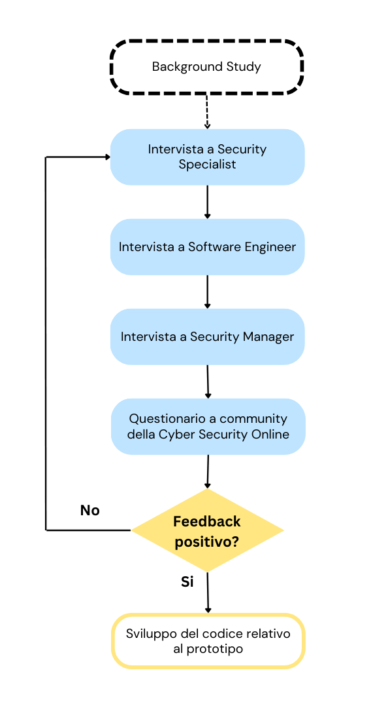

# Assignment 2 - Processo e Sviluppo del Software

## Git URL
https://gitlab.com/bicoccaprojects/2023_assignment2_interview

## Membri del Gruppo

- Claudio Ricci mtr. 918956

- Damiano Ficara mtr. 919386

## Obiettivo dell'Assignment
L'assignment si propone di delineare una strategia volta a raccogliere informazioni cruciali per l'implementazione di un progetto software in fase di sviluppo. Inquadrandoci nell'ambito del requirements engineering, l'attenzione sarà focalizzata sulla comprensione del comportamento che una soluzione software dovrebbe adottare per affrontare un problema specifico. Pertanto, è necessario inizialmente investigare la natura del problema da risolvere al fine di comprenderne il contesto in cui si manifesta.

## Background Study
La cybersecurity rappresenta oggi un tema di grande rilevanza nell’ambito dell’informatica e della tecnologia. Tra le problematiche maggiormente rilevanti si annoverano le vulnerabilità delle applicazioni software, la cui scoperta e correzione costituiscono una priorità per gli sviluppatori e gli esperti di sicurezza.

Nel contesto dell’informatica, il NIST (National Institute of Standards and Technology) definisce una vulnerabilità come una debolezza in un sistema informatico, nelle procedure di sicurezza del sistema, nei controlli interni di questo o nella sua implementazione, che potrebbe essere sfruttata o innescata da una fonte di minaccia.

CVE (Common Vulnerabilities and Exposures) è uno standard di identificazione delle vulnerabilità informatiche utilizzato a livello internazionale per riferirsi a specifici problemi di sicurezza informatica. Il formato del codice CVE, chiamato anche identificatore CVE o CVE ID, `e costituito da un prefisso ”CVE” seguito da un identificatore numerico univoco. 

L’identificatore numerico univoco del codice CVE e importante perchè consente di distinguere la vulnerabilità in questione da tutte le altre vulnerabilità segnalate o scoperte in precedenza o in seguito. Ciò consente ai ricercatori di sicurezza informatica e agli esperti di gestione dei rischi di fare riferimento in modo univoco alla vulnerabilità e di prendere le misure necessarie per mitigare i rischi associati ad essa.

### System-as-is
Esiste già un sistema che valuta la severità di una vulnerabilità informatica, il sistema CVSS (CVE Severity Score), ma questo ha parecchi limiti. Questo sistema assegna una valutazione a ogni vulnerabilità ma non misura l’impatto di una vulnerabilità perché non è nato per questo scopo. Dunque, dati due valori CVSS, non si è in grado di dire quale dei due sia più urgente da gestire. Lo stesso punteggio CVSS può avere un impatto diverso nel tempo, oppure può avere impatti diversi in sistemi diversi.

Inoltre, secondo un rapporto del 2022 pubblicato da FlashPoint (https://www.scmagazine.com/news/half-of-10-0-cvss-vulnerabilities-reported-so-far-in-2022-scored-incorrectly), è emerso che circa la metà delle vulnerabilità considerate più critiche potrebbe essere stata valutata in modo errato. Nel corso degli ultimi 10 anni, si è verificato che in media il 51,5% di tutte le vulnerabilità con un punteggio CVSS di 10.0 non corrispondesse effettivamente a tale valutazione. Ciò implica che le aziende potrebbero dare priorità a centinaia di problemi che non raggiungono il massimo livello di gravità come indicato dal punteggio CVSS. Flashpoint ha condotto un’analisi su 11.860 vulnerabilità relative agli ultimi 10 anni e ha rilevato che il 27,3% di queste vulnerabilità è stato erroneamente segnalato o erroneamente descritto dai servizi CVE.

Questa ricerca evidenzia l’importanza di considerare tali limitazioni e sottolinea la necessità di integrare il sistema CVSS con altre metodologie e valutazioni per ottenere una valutazione più completa e accurata dei rischi di sicurezza. Tale integrazione consentirebbe alle aziende di prendere decisioni informate e prioritarie sulla gestione delle vulnerabilità, andando oltre la valutazione basata esclusivamente sul punteggio CVSS.

### System-to-be
Il sistema che si andrà a sviluppare prende in input un codice CVE e raccoglie da diverse fonti online contenuti rilevanti rispetto all’input. Successivamente, i contenuti raccolti vengono sottoposti ad un’analisi del sentimento effettuata tramite machine-learning al fine di estrapolare un “indicatore di interesse” relativo alla vulnerabilità in questione. Tale indicatore potrà fornire utili informazioni circa la percezione degli utenti riguardo la gravita e l’importanza della vulnerabilità stessa. Il sistema di sentiment analysis sviluppato, grazie alla sua capacità di analizzare automaticamente numerose fonti di informazioni, fornisce un punteggio sentimentale che riflette su una specifica CVE.

## Elicitation Strategy
### Stakeholders
- **Security Specialist**: nell'ambito delle attività quotidiane di un Security Specialist, si pone particolare attenzione all'analisi delle vulnerabilità, identificate mediante codici CVE, e alla successiva identificazione e valutazione di tali vulnerabilità al fine di comprenderne la gravità. Questo professionista riveste un ruolo cruciale nel contesto della sicurezza informatica, contribuendo in modo significativo all'identificazione e alla mitigazione dei rischi. La sua esperienza e competenza specialistica lo collocano in una posizione chiave, influenzando direttamente l'efficacia delle strategie di sicurezza adottate.\La buona riuscita del tool proposto rappresenta un interesse particolare per il Security Specialist, in quanto potrebbe offrire uno strumento che ottimizza il processo di analisi delle CVE, consentendo un risparmio di tempo e, allo stesso tempo, fornendo un supporto automatizzato per l'analisi delle vulnerabilità. Intendiamo coinvolgere questo stakeholder attraverso un'intervista approfondita, al fine di acquisire una prospettiva più dettagliata sulla sua expertise specifica in materia di sicurezza informatica. La sua partecipazione attiva contribuirà in modo significativo all'analisi del contesto di sicurezza del progetto, garantendo un approccio informatico robusto e adeguato alle sfide emergenti nel panorama della sicurezza informatica. Nello specifico questo stakeholder rappresenterà l'utilizzatore finale del tool.

- **Software Developer con Competenze in AI**: il Software Developer con competenze in intelligenza artificiale (AI) riveste un ruolo essenziale nel nostro progetto. Desideriamo condurre un'intervista approfondita con questo professionista per acquisire conoscenze preziose sullo sviluppo del progetto di sentiment analysis. La sua expertise potrebbe rivelarsi fondamentale nel definire le migliori pratiche e nell'indirizzare le scelte tecniche per garantire un'implementazione ottimale dell'analisi dei sentimenti.\Inoltre, riteniamo che il Software Developer con Competenze in AI possa fornire input significativi sulle tecniche di intelligenza artificiale più adatte per l'analisi delle informazioni sulle CVE. La sua comprensione avanzata delle metodologie AI potrebbe contribuire in modo cruciale a migliorare l'efficacia della nostra analisi delle vulnerabilità.\Questo professionista svolge un ruolo chiave nella progettazione dell'analisi dei sentimenti attraverso l'intelligenza artificiale, apportando competenze specializzate per garantire una solida e avanzata implementazione delle funzionalità di sentiment analysis nel contesto del progetto. La sua partecipazione attiva ci consentirà di attingere a un pool di conoscenze tecniche e pratiche essenziali per il successo complessivo del progetto.

- **Security Manager**: il Security Manager è la figura che sovrintende alla gestione di un reparto di specialisti della sicurezza.\Riteniamo che un'intervista con con questo stakeholder può rivelarsi cruciale per ottenere un punto di vista strategico sulla necessità di investire in un tool di ricerca automatica delle informazioni. La sua esperienza consolidata nella coordinazione del reparto di sicurezza lo posiziona come un decision-maker chiave per valutare l'efficacia e la pertinenza degli strumenti automatizzati.\La competenza del Security Manager nell'orchestrare le attività del reparto di sicurezza si traduce in una prospettiva preziosa per la valutazione di strumenti che mirano a migliorare l'efficienza e l'efficacia dell'analisi delle informazioni critiche, come quelle legate alle vulnerabilità CVE. La sua partecipazione attiva nella decisione sull'adozione di strumenti automatici è guidata dalla sua vasta esperienza nella gestione della sicurezza, posizionandolo come un attore chiave nella determinazione delle strategie e delle tecnologie più idonee a garantire la sicurezza dell'organizzazione.

- **Cybersecurity community**: la community online della Cybersecurity è un ambiente estremamente attivo e vasto, soprattutto su piattaforme come Reddit. La comunità delle CVE su Reddit è particolarmente dinamica, focalizzandosi sulla segnalazione, discussione e risoluzione di vulnerabilità informatiche. Nei subreddit dedicati è possibile accedere a notizie aggiornate su nuove vulnerabilità scoperte, partecipare a discussioni tecniche riguardo alla loro natura e scoprire metodi per mitigarle.\Per sfruttare appieno le risorse e le competenze presenti in questa comunità, stiamo considerando l'idea di pubblicare un questionario su siti frequentati dagli esperti di cybersecurity. Questo questionario mira a raccogliere requisiti e feedback direttamente dalla comunità stessa. Vorremmo capire le esigenze, le sfide e le aspettative degli esperti in materia di vulnerabilità informatiche, in modo da adattare il nostro progetto alle reali necessità della community.\L'interazione con la comunità online della cybersecurity rappresenta una risorsa inestimabile, consentendo una partecipazione attiva degli esperti nel plasmare e perfezionare il nostro approccio. In questo modo, puntiamo a sviluppare soluzioni più mirate e pertinenti, promuovendo una collaborazione sinergica che beneficia l'intera comunità nella lotta contro le minacce informatiche.

| Stakeholder             | Potere | Interesse | Strategia         |
|:------------------------:|:------:|:---------:|:-----------------:|
| Security Specialist     | Basso  | Alto      | Pienamente coinvolto |
| Software Engineer        | Basso  | Basso     | Sforzo minimo     |
| Security Manager         | Alto   | Basso     | Soddisfare        |
| Cybersecurity Community  | Basso  | Alto      | Sforzo minimo     |

### Workflow

  

La diversità di competenze e responsabilità di questi stakeholder costituisce un elemento fondamentale per arricchire il panorama di progettazione e implementazione del nostro progetto. La raccolta di informazioni attraverso le interviste mira a garantire un approccio completo e adattato alle esigenze specifiche di ciascun settore coinvolto.

In caso di riscontro positivo durante le interviste, procederemo con fiducia allo sviluppo del tool, sfruttando la ricchezza di conoscenze e prospettive fornite dagli stakeholder. Tuttavia, nel caso in cui emergano requisiti non soddisfatti o nuove considerazioni durante il processo, saremo pronti a tornare indietro e ripetere le attività di analisi dei requisiti. Questo approccio flessibile è essenziale per assicurare che il nostro progetto si allinei in modo ottimale alle aspettative e alle necessità reali degli utenti finali, garantendo il massimo impatto e successo. La collaborazione continua con gli stakeholder rimarrà un elemento chiave per adattare e perfezionare il tool lungo tutto il suo ciclo di sviluppo.

## Attività del workflow

### Security specialist

**Scoperta dei Requisiti:**

Attraverso questa intervista, miriamo a delineare i requisiti tecnici che il nostro tool deve soddisfare. La nostra attenzione è focalizzata, in particolare, sui requisiti relativi alle informazioni da raccogliere durante l'analisi di una CVE e sulla specifica localizzazione di tali dati, sia essa su siti web, blog o subreddit. Questa fase è finalizzata a definire in modo preciso cosa il nostro strumento deve essere in grado di ottenere e da dove, garantendo così la capacità di fornire risultati pertinenti e utili per gli utenti nel contesto della sicurezza informatica.

In aggiunta, durante l'intervista, verranno poste una serie di domande per comprendere meglio le aspettative dello stakeholder riguardo alle informazioni desiderate come risultato di una ricerca su una CVE, quindi riguardo ai requisiti grafici. Questo approccio mira a rafforzare la nostra comprensione delle esigenze specifiche dello Specialista di Sicurezza, garantendo che il tool sia progettato in modo da rispondere appieno alle sue aspettative.

**Descrizione:**

L'obiettivo è comprendere appieno le esigenze dello Specialista di Sicurezza per garantire che il tool fornisca il supporto necessario nel contesto dello studio delle CVE.
Il focus dell'intervista riguarda le informazioni che il tool deve raccogliere per ogni CVE identificata. Questo include non solo i dati di base sulla vulnerabilità, ma anche dettagli specifici che possano supportare una valutazione accurata della pericolosità di una CVE.

**Ragioni dell'Intervista:**
Riconosciamo che uno Specialista di Sicurezza si trova quotidianamente a investire tempo nella raccolta di informazioni riguardanti la pericolosità di una CVE. Questo processo, spesso ripetitivo e laborioso, può comportare la necessità di navigare attraverso diverse fonti. Il tool mira a semplificare questo processo, identificando le esigenze chiave dello Specialista di Sicurezza e garantendo che il tool sviluppato sia allineato alle sue necessità operative.

La scelta di intervistare questo stakeholder, quindi, si basa sulla consapevolezza che l'esperienza e la comprensione umana rimangono irrinunciabili. La conversazione diretta con uno specialista ci consente di catturare sfumature e dettagli che potrebbero sfuggire a un approccio puramente automatizzato.

Attraverso questa intervista, miriamo a ottenere un quadro completo delle esigenze e delle aspettative dello Specialista di Sicurezza, garantendo che il tool che stiamo sviluppando non solo semplifichi il processo di gestione delle CVE, ma lo ottimizzi in modo specifico per le necessità quotidiane di chi opera in questo settore critico.

### Intervista a Security Specialist

- **Requisiti Tecnici:**
    - **Sorgenti di Informazioni:** Quali siti web o piattaforme online ritiene che siano più affidabili e ricche di informazioni riguardo alle CVE? Utilizzi anche social network come Reddit o X per informarti? Se si, quali canali/subreddit?
        
        **Fonti di Informazioni Rilevanti:** Oltre a CVE, quali altre fonti di informazioni online ritiene siano rilevanti per arricchire l'analisi del sentimento? (Es. forum, blog, social media)
        
    - **Tipi di Informazioni Rilevanti:** Quali tipi di informazioni relative a una CVE ritiene siano fondamentali per un'analisi approfondita?
    - **Parametri di Ricerca:** Quali parametri ritiene siano cruciali per una ricerca efficace di informazioni su una CVE? Ad esempio, versioni del software, dettagli tecnici specifici, etc.
    - Ci sono particolari dati tecnici, come exploit code, patch, o analisi di impatto, che vorrebbe includere nel risultato della ricerca?
- **Requisiti Grafici:**
    - **Interfaccia Utente:** Quali elementi visivi ritiene siano importanti nell'interfaccia utente del tool? Preferisce un'interfaccia minimalista o una più dettagliata?
    - **Formato dei Risultati:** Come preferirebbe ricevere i risultati delle ricerche? (Ad esempio, un elenco strutturato, grafici, ecc.)
    - Ci sono formati specifici di output che trova più pratici?
    - **Personalizzazione:** Preferisce un tool con opzioni di personalizzazione, ad esempio, la possibilità di configurare i siti da cui attingere informazioni o definire criteri di ricerca avanzati?
    - **Notifiche e Alert:** Ritiene importante ricevere notifiche o alert immediati in caso di nuove informazioni rilevanti per una CVE specifica?
- **Altre Considerazioni:**
    - **Strumenti Attuali:** Usa attualmente strumenti simili per ottenere informazioni sulle CVE? Se sì, quali funzionalità apprezza di più o ritiene siano carenti?

### Software Engineer

**Scoperta dei Requisiti:**

L'obiettivo di questa intervista è identificare in modo approfondito i requisiti tecnici necessari per implementare con successo la sentiment analysis attraverso il nostro tool. Stiamo cercando di comprendere le competenze e le metodologie che uno sviluppatore software ritiene essenziali per garantire l'efficacia e l'accuratezza della sentiment analysis.

**Descrizione:**

L'attenzione principale durante l'intervista sarà sulle tecniche di manipolazione dei dati. Non solo ci interessa comprendere come il tool elaborerà il testo, ma anche come sarà in grado di catturare e interpretare il sentiment in modo accurato. Discuteremo in dettaglio le metodologie di machine learning e l'approccio al pre-processing dei dati necessario per ottenere risultati affidabili nella sentiment analysis.

**Ragioni dell’intervista**

La sentiment analysis è una disciplina complessa che richiede una profonda comprensione delle tecniche di Natural Language Processing e della gestione dei dati. Intervistare uno sviluppatore software con queste competenze ci consente di ottenere una visione dettagliata su come il tool dovrebbe essere strutturato tecnologicamente per soddisfare le esigenze della sentiment analysis.

Attraverso questa intervista, miriamo a ottenere una comprensione dettagliata delle competenze tecniche necessarie per sviluppare un tool di sentiment analysis altamente efficace. L'obiettivo è garantire che il tool non solo soddisfi i requisiti funzionali per eseguire la sentiment analysis, ma che sia anche tecnicamente robusto e allineato alle migliori pratiche nello sviluppo di soluzioni di analisi del sentiment.

### Intervista a Software engineer

- **Sull'Analisi del Sentimento:**
    - **Metodi di Analisi del Sentimento:** Quali strumenti o librerie di Natural Language Processing (NLP) ritiene più efficaci per l'analisi del sentimento? (Ad esempio, NLTK, spaCy, TensorFlow, etc.)
    - **Pre-elaborazione del Testo:** Quali passaggi di pre-elaborazione del testo considera importanti per ottenere risultati accurati nell'analisi del sentimento?
    - **Addestramento del Modello:** Preferisce l'uso di modelli pre-addestrati per l'analisi del sentimento o la creazione di un modello personalizzato basato sui dati specifici?
        
        Esistono modelli che sono già addestrati a trattare testi riguardanti questo dominio?
        
    - **Lingua e Contesto:** Ci sono considerazioni specifiche per l'analisi del sentimento in lingue o contesti particolari che ritiene importanti?
    - **Selezione del Modello NLP:** Quali criteri suggerirebbe per la selezione di un modello NLP specifico per l'analisi del sentimento? Cosa ritiene importante nella scelta di un approccio di analisi del testo?
    - **Adattabilità a Diverse Lingue:** Come affronterebbe la sfida dell'adattamento del tool per l'analisi del sentimento in diverse lingue? Ci sono modelli o tecniche che consiglierebbe in questo contesto?
    - **Gestione dell'Incertezza:** Come trattarebbe l'incertezza nei risultati dell'analisi del sentimento? Ha suggerimenti su come gestire i casi in cui il testo potrebbe avere ambiguità?
    - **Personalizzazione del Modello:** Ritiene che un modello di analisi del sentimento debba essere addestrato sui dati specifici dell'utente? In tal caso, come gestirebbe questa personalizzazione?
- **Raccolta di Contenuti Online:**
    - **Web Scraping vs API:** Preferirebbe utilizzare il web scraping o l'accesso tramite API per raccogliere contenuti online? Ha considerazioni specifiche su quando utilizzare uno o l'altro?
    - **Etica e Limiti del Web Scraping:** Quali considerazioni etiche suggerirebbe durante il processo di web scraping? Come eviterebbe di violare i termini di servizio o le normative sulla privacy?
    - **Gestione dell'Autenticazione:** Nel caso di siti web o servizi che richiedono autenticazione, come affronterebbe la gestione delle credenziali nel processo di raccolta di dati?
    - **Controllo della Qualità dei Dati:** Come garantirebbe la qualità dei dati raccolti tramite web scraping o API? Ha suggerimenti su come affrontare la presenza di informazioni inaffidabili o obsolete?
- **Sviluppo del Tool:**
    - **Linguaggio di Programmazione:** Quali linguaggi di programmazione ritiene più adatti per lo sviluppo del tool? Ha preferenze specifiche?
    - **Architettura del Software:** Come suggerirebbe di strutturare l'architettura del software per massimizzare l'efficienza e la manutenibilità?
    - **Scalabilità:** Quali considerazioni bisogna tenere in considerazione per garantire la scalabilità del tool, specialmente se si prevede un aumento del carico?
    - **Integrazione di Altri Strumenti:** Ci sono strumenti o piattaforme esistenti che consiglierebbe di integrare con il tuo tool per ottenere risultati migliori?
    

### Security Manager
**Scoperta dei Requisiti:**

L'obiettivo principale di questa intervista è acquisire una comprensione approfondita delle esigenze specifiche di un Security Manager in relazione al tool che stiamo sviluppando. L'intento è individuare in modo dettagliato i requisiti chiave necessari per soddisfare le esigenze di gestione e monitoraggio della sicurezza delle CVE, concentrando l'attenzione sulle prestazioni, i vantaggi aziendali e le motivazioni per l'adozione del nuovo strumento.

**Descrizione:**

Durante l'intervista, cercheremo di mettere in luce le funzionalità del tool che influiscono direttamente sulla gestione della sicurezza, con particolare enfasi sulle prestazioni attese. Discuteremo anche delle caratteristiche ritenute fondamentali dal Security Manager per prendere decisioni informate sulla mitigazione delle vulnerabilità e garantire la conformità alle politiche di sicurezza dell’azienda.

**Ragioni dell’Intervista:**

L'intervista ha l'obiettivo di ottenere una comprensione approfondita delle specifiche esigenze del Security Manager, con l'intento di guidare lo sviluppo di un tool che non solo fornisca informazioni tecniche dettagliate, ma che offra vantaggi tangibili e prestazioni ottimali. Questa analisi mira a creare un quadro completo delle necessità del Security Manager, assicurando che il nostro strumento sia progettato e sviluppato per rispondere in modo efficace alle sfide quotidiane della gestione della sicurezza informatica. L'attenzione è posta non solo sulla fornitura di dati dettagliati, ma anche sulla creazione di un valore concreto attraverso l'ottimizzazione delle prestazioni e la realizzazione di benefici misurabili per l'intera organizzazione.

### Intervista a Security Manager

**Gestione delle CVE:**
- *Prioritizzazione delle Vulnerabilità:* Quali criteri specifici vengono utilizzati per dare priorità alle CVE, e in che modo ritiene che il nostro tool possa facilitare o migliorare questo processo?
- *Comunicazione delle Minacce:* Come pensa che una comunicazione efficiente delle minacce, attraverso il nostro tool, possa migliorare la reattività aziendale? Ci sono aspetti specifici che ritiene cruciali?
- *Analisi dell'Impatto Aziendale:* Quali informazioni ritiene essenziali per valutare l'impatto potenziale di una CVE sulle operazioni aziendali? In che modo il nostro tool potrebbe portare beneficio a questa analisi?

**Integrazione con Strumenti Esistenti:**

- *Gestione degli Incidenti:* In che modo preferirebbe che il nostro tool si potrebbe integrare con i processi di gestione degli incidenti esistenti? Quali informazioni dovrebbero essere automaticamente condivise al fine di velocizzare la risposta a tali problematiche?
- *Integrazione con Altri Strumenti di Sicurezza:* Esistono 
strumenti di sicurezza specifici (ad esempio, sistemi S.I.E.M(Security Information and Event Management), firewall, 
antivirus) con cui ritiene che il nostro tool dovrebbe integrarsi per 
massimizzare l'efficacia complessiva della sicurezza? Come immagina 
questa integrazione che supporta le operazioni di sicurezza quotidiane?

**Requisiti di Conformità:**

- *Normative e Standard:* Quali normative o standard di sicurezza sono di primaria importanza per la vostra azienda? In che modo il tool proposto potrebbe contribuire alla conformità con questi requisiti?
- *Reportistica per Audit:* Quali tipi di report o documentazione ritiene indispensabili per agevolare le attività di audit e dimostrare la conformità alle normative di sicurezza?

**Gestione Utenti e Autorizzazioni:**
- *Accesso e Controllo:* Come vorrebbe gestire l'accesso e definire le autorizzazioni del tool per garantire che gli utenti accedano solo alle informazioni pertinenti al loro ruolo? Ci sono livelli di personalizzazione che ritiene necessari?
- *Audit delle Attività:* Quanto ritiene importante una registrazione dettagliata delle attività degli utenti per fini di audit e sicurezza?

**Prestazioni e Vantaggi Aziendali:**
- *Implementazione nella Rete:* Ci sono requisiti specifici per l'implementazione del tool nella rete aziendale? Come si aspetta che il tool migliori concretamente le prestazioni complessive della sicurezza?
- *Supporto Tecnico:* Quali livelli di supporto tecnico ritiene essenziali per garantire un'implementazione senza intoppi e la risoluzione tempestiva di eventuali problemi?
- *Motivazione economiche:* Ritiene che avrebbe senso investire in un tool che va ad automizzare un processo/attività aziendale già svolto attualmente da una persona? **

**Community e Possibili Falsi Positivi:**

- *Coinvolgimento della Community:* Ritiene importante coinvolgere la community nella gestione delle CVE? In che modo il tool potrebbe beneficiare di questo coinvolgimento?
- *Gestione dei Falsi Positivi:* Come gestirebbe il potenziale problema dei falsi positivi nel contesto delle CVE? Ci sono approcci specifici che reputa efficaci per ridurre al minimo i falsi positivi e mantenere l'affidabilità delle segnalazioni?

### Questionario community

**Scoperta dei Requisiti:**

I requisiti che intendiamo acquisire tramite questo questionario sono coincidenti con quelli che desideriamo raccogliere durante l'intervista con il security specialist, ovvero, requisiti tecnici su dove raccogliere informazioni, requisiti grafici su quali informazioni restituire in output.

**Descrizione:**

L'obiettivo principale di questa intervista è ottenere una comprensione approfondita delle esigenze di potenziali utenti, garantendo che il nostro tool fornisca il supporto necessario nel contesto dello studio delle CVE. La partecipazione degli utenti in questa fase è fondamentale per plasmare uno strumento che risponda appieno alle loro aspettative e necessità nel campo della sicurezza informatica.

**Ragioni dell'Intervista:**
Sottoporre un questionario alla community online della cybersecurity rappresenta un metodo rapido ed efficiente per acquisire una vasta quantità di informazioni, arricchendo così il nostro tool. La diversità di prospettive e competenze presenti nella community offre un'opportunità preziosa per catturare una panoramica completa delle esigenze e delle aspettative degli utenti nel campo della sicurezza informatica. Questo approccio ci consente di rafforzare la robustezza del tool, assicurando che sia progettato in modo rispondere in modo ottimale alle dinamiche e alle sfide del contesto cyber.

### Domande

1. Quali sono le principali fonti da cui ottieni informazioni sulle CVE? 
    1. Siti di notizie di cybersecurity
    2. Reddit
    3. Telegram
    4. X
    5. Altro 
    
    **Motivazione:** Comprendere da dove gli esperti di 
    sicurezza attingono le loro informazioni è essenziale per valutare la 
    fiducia nelle fonti. Identificare le fonti più utilizzate può anche 
    aiutare a migliorare l'efficacia della distribuzione delle informazioni.
    
2. Quali criteri utilizzi per valutare la gravità di una CVE? (Es impatto aziendale, presenza di exploit)
    1. Impatto aziendale
    2. Presenza di Exploit
    3. Rilevanza nei contesti critici
    4. Elevato potenziale di diffusione
    5. Altro
    
    **Motivazione:** Capire i criteri prioritari per la 
    valutazione di una CVE fornisce informazioni preziose sulle priorità di 
    sicurezza. Ciò aiuta a personalizzare gli approcci di gestione delle 
    vulnerabilità in base alle esigenze aziendali specifiche.
    
3. Pensi che il sistema CVSS (Common Vulnerability Scoring System) attuale sia sufficiente per valutare la severità di una CVE?
    1. Pienamente d’accordo
    2. D’accordo
    3. Non d’accordo
    4. Per niente d’accordo
    
    **Motivazione:** Ottenere una valutazione della percezione 
    del CVSS aiuta a identificare se esistono preoccupazioni diffuse sulla 
    sua adeguatezza. Questo può guidare eventuali sforzi per migliorare o 
    integrare sistemi di valutazione esistenti.
    
4. Ritieni importante avere una sentiment analysis associata alle informazioni sulle CVE?
    1. Estremamente utile
    2. Utile
    3. Non molto utile
    4. Per niente utile
    
    **Motivazione:** Comprendere se gli esperti di sicurezza 
    ritengono utile l'analisi del sentiment aiuta a determinare l'importanza
     di considerazioni non tecniche nella gestione delle vulnerabilità.
    
5. Pensi che il coinvolgimento della community sia cruciale per la gestione delle CVE? 
    1. Estremamente utile
    2. Utile
    3. Non molto utile
    4. Per niente utile
    
    **Motivazione:** Valutare la percezione sull'importanza 
    della partecipazione della community fornisce indicazioni sulla volontà 
    di collaborare e condividere informazioni tra gli esperti di sicurezza.
    
6. Quali sono i principali ostacoli che potrebbero limitare il coinvolgimento attivo della community nella gestione delle CVE?
    1. Mancanza di consapevolezza
    2. Complessità tecnica
    3. Difficoltà nell'accesso alle informazioni
    4. Falsi positivi
    5. Altro
    
    **Motivazione:** Identificare gli ostacoli comuni aiuta a 
    individuare aree in cui potrebbe essere necessario concentrare gli 
    sforzi per migliorare la partecipazione della community nella gestione 
    delle CVE
    
7. Cosa desidereresti da uno strumento automatizzato per la gestione delle CVE? **Ci sono funzionalità specifiche che vorresti vedere implementate?**
    1. Notifiche tempestive
    2. Report dettagliati
    3. Prioritizzazione delle patch
    4. Risposte brevi e concise
    5. Altro
    
    **Motivazione:** Comprendere le aspettative e le priorità 
    degli utenti rispetto agli strumenti automatizzati aiuta a sviluppare 
    soluzioni che si adattano alle esigenze specifiche degli esperti di 
    sicurezza.
    
8. Hai preferenze riguardo al formato dei risultati delle ricerche sulle CVE?
    1. Elenco strutturato
    2. Grafico
    3. Report dettagliato
    4. Heatmap
    5. Altro
    
    **Motivazione:** Conoscere le preferenze di presentazione 
    delle informazioni aiuta a progettare interfacce utente più intuitive e 
    utili per la gestione delle vulnerabilità.
    
9. Come preferiresti ricevere notifiche o avvisi riguardo a nuove CVE rilevanti per i tuoi interessi o la tua organizzazione? (Es. e-mail, notifiche push, feed RSS, altro)
    1. E-mail
    2. Notifiche push
    3. Feed RSS
    4. Social
    5. Altro
    
    **Motivazione:** Identificare il canale preferito per 
    ricevere notifiche consente di personalizzare la distribuzione delle 
    informazioni per massimizzare l'efficacia delle comunicazioni sulla 
    sicurezza.
    
10. Ti va di rispondere ad alcune domande aperte?
    1. Si
    2. No
    
    **Motivazione:** Le domande aperte offrono la possibilità 
    di ottenere dettagli specifici e contestuali sulle esperienze personali 
    degli utenti, fornendo informazioni approfondite sulla gestione attuale 
    delle CVE e sulle esigenze future.
    
11. Domande Aperte
    1. Quali funzionalità trovi più utili o, al contrario, mancanti nei tuoi attuali strumenti o processi?
    2. In che modo, il tool sviluppato, potrebbe influenzare la tua percezione e gestione delle vulnerabilità?
    3. Come attualmente raccogli e gestisci le informazioni sulle CVE? Ci sono strumenti o processi che ritieni particolarmente utili?**
